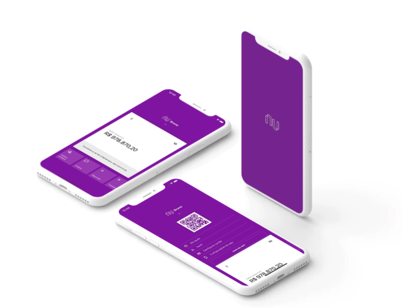

    

  <a href="#projeto">Projeto</a>&nbsp;&nbsp;&nbsp;|&nbsp;&nbsp;&nbsp;
  <a href="#tecnologias">Tecnologias</a>&nbsp;&nbsp;&nbsp;|&nbsp;&nbsp;&nbsp;
  <a href="#setup">Setup</a>&nbsp;&nbsp;&nbsp;|&nbsp;&nbsp;&nbsp;
  <a href="#layout">Layout</a>&nbsp;&nbsp;&nbsp;|&nbsp;&nbsp;&nbsp;
  <a href="#licença">Licença</a>

## Projeto

O Be The Hero é um projeto que visa conectar pessoas a ONGs e visualizar seus CASOS de forma simples e direta.

Na plataforma Web as Ongs realizam seus cadastros e postam seus casos, ja na plataforma mobile todos os usuários tem acesso aos casos e escolhem quais desejam ajudar.

Aprimorando o backend com testes em #Jest com auxilio do #Supertest. E usando o #Celebrate para realizar validações dos dados enviados.

## Tecnologias

Esse projeto Backend, foi desenvolvido com as seguintes tecnologias:

- [JavaScript](https://developer.mozilla.org/pt-BR/docs/Web/JavaScript)
- [HTML](https://developer.mozilla.org/pt-BR/docs/Web/HTML)
- [CSS](https://developer.mozilla.org/pt-BR/docs/Web/CSS)
- [Node.js](https://nodejs.org/en/)
- [React](https://reactjs.org)
- [React Native](https://facebook.github.io/react-native/)

## Setup

Clone o repositório em sua maquina:

`git clone https://github.com/BrunoLagoa/InterfaceNubank`

- Entre na pasta do projeto execute `yarn` para instalar todas as dependencies
- Execute `react-native run-ios` ou `react-native run-android` para iniciar o projeto

## Layout

    

    

## Licença

Esse projeto está sob a licença MIT. Veja o arquivo [LICENSE](LICENSE.md) para mais detalhes.

---

[Bruno Castro](http://www.brunocastro.dev) - [bruno@bhzautomacao.com.br](mailto:bruno@bhzautomacao.com.br) - Development
